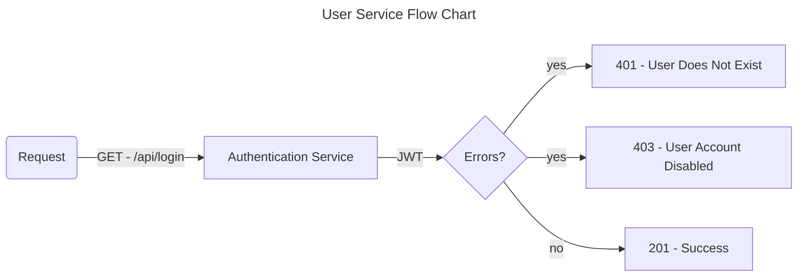
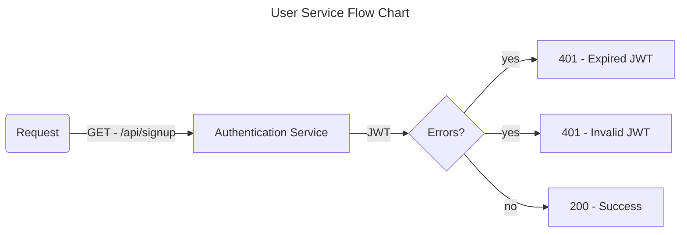
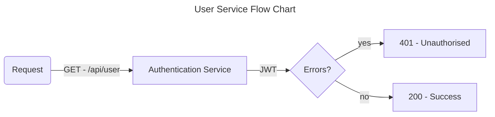
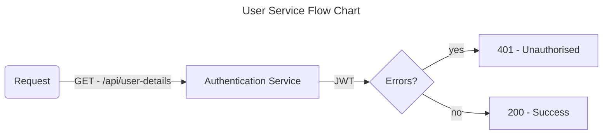

```mermaid
---
title: User Service Flow Chart
---

flowchart LR
    HttpRequest(Request) -->|GET - /api/login| AuthenticationService[Authentication Service]
    AuthenticationService -->|JWT| Errors{Errors?}
    Errors -->|yes| UserDoesNotExistResponse[401 - User Does Not Exist]
    Errors -->|yes| UserAccountDisabledResponse[403 - User Account Disabled]
    Errors -->|no| SuccessResponse[201 - Success]
```

```mermaid
---
title: User Service Flow Chart
---

flowchart LR
    HttpRequest(Request) -->|GET - /api/signup| AuthenticationService[Authentication Service]
    AuthenticationService -->|JWT| Errors{Errors?}
    Errors -->|yes| ExpiredJwtResponse[401 - Expired JWT]
    Errors -->|yes| InvalidJwtResponse[401 - Invalid JWT]
    Errors -->|no| SuccessResponse[200 - Success]
```

```mermaid
---
title: User Service Flow Chart
---

flowchart LR
    HttpRequest(Request) -->|GET - /api/user| AuthenticationService[Authentication Service]
    AuthenticationService -->|JWT| Errors{Errors?}
    Errors -->|yes| UnauthorisedResponse[401 - Unauthorised]
    Errors -->|no| SuccessResponse[200 - Success]
```

```mermaid
---
title: User Service Flow Chart
---

flowchart LR
    HttpRequest(Request) -->|GET - /api/user-details| AuthenticationService[Authentication Service]
    AuthenticationService -->|JWT| Errors{Errors?}
    Errors -->|yes| UnauthorisedResponse[401 - Unauthorised]
    Errors -->|no| SuccessResponse[200 - Success]
```